# 🎓 Student Performance & Behavior Dashboard (Power BI)

## 📌 Project Overview

The Student Performance & Behavior Dashboard is an interactive Power BI solution designed to analyze academic performance, attendance records, and student behavior. The dashboard enables users to monitor performance trends, attendance percentages, and behavioral patterns through interactive visualizations and filters.

---

# 🎯 Objectives

* Analyze student academic performance.
* Monitor attendance percentage.
* Track student behavior records.
* Compare subject-wise performance.
* Identify performance categories.
* Enable interactive data exploration.
* Provide student-level analysis through drillthrough functionality.

---

# 🛠️ Tools & Technologies

* Microsoft Power BI Desktop
* Power Query
* DAX (Data Analysis Expressions)
* Microsoft Excel

---

# 📂 Dataset Files

The project uses the following datasets:

* Students.xlsx
* Scores.xlsx
* Attendance.xlsx
* Behavior.xlsx

---

# 📊 Data Model

The dashboard follows a star schema model where the Students table acts as the central table.

### Relationships

* Students → Scores
* Students → Attendance
* Students → Behavior

### Relationship Type

* One-to-Many (1:*)

---

# 📈 Dashboard Features

### KPI Cards

* Total Students
* Average Score
* Attendance Percentage

### Visualizations

* Average Score by Subject (Bar Chart)
* Performance Trend by Term (Line Chart)
* Behavior Distribution (Donut Chart)
* Student Performance Table

### Interactive Elements

* Class Slicer
* Section Slicer
* Subject Slicer
* Term Slicer
* Drillthrough Page
* Tooltip Page
* Bookmark Navigation
* Mobile Layout

---

# 🧮 DAX Measures

## Total Students

```DAX
Total Students =
DISTINCTCOUNT(Students[StudentID])
```

## Average Score

```DAX
Average Score =
AVERAGE(Scores[Score])
```

## % Score

```DAX
% Score =
DIVIDE(
    SUM(Scores[Score]),
    SUM(Scores[MaxScore]),
    0
)
```

## Average Score per Subject

```DAX
Average Score per Subject =
AVERAGE(Scores[Score])
```

## Attendance %

```DAX
Attendance % =
DIVIDE(
    CALCULATE(
        COUNTROWS(Attendance),
        Attendance[Status] = "Present"
    ),
    COUNTROWS(Attendance),
    0
)
```

## Behavior Count

```DAX
Behavior Count =
COUNTROWS(Behavior)
```

---

# 🏷️ Calculated Column

## Performance Category

```DAX
Performance Category =
SWITCH(
    TRUE(),
    DIVIDE(Scores[Score], Scores[MaxScore]) >= 0.8, "High",
    DIVIDE(Scores[Score], Scores[MaxScore]) >= 0.5, "Medium",
    "Low"
)
```

---

# 📸 Dashboard Screenshots

## 1. Full Dashboard Overview

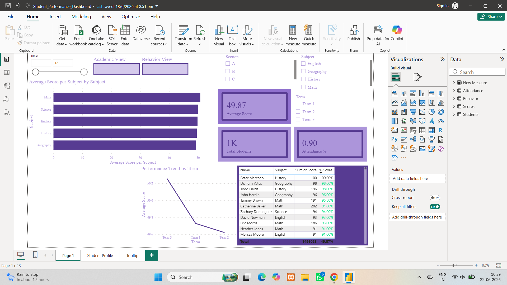

Displays the complete dashboard including KPI cards, charts, table, and slicers.

---

## 2. Data Model View

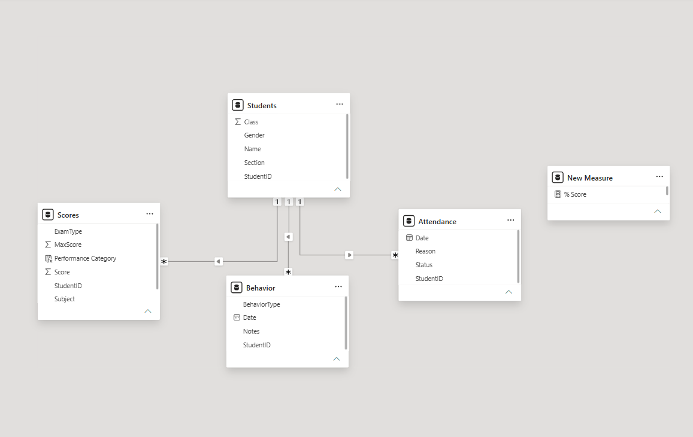

Shows relationships between Students, Scores, Attendance, and Behavior tables.

---

## 3. DAX Measures

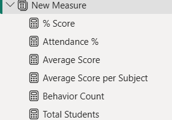

Displays all measures created inside the **New Measures** table.

---

## 4. KPI Card Visuals

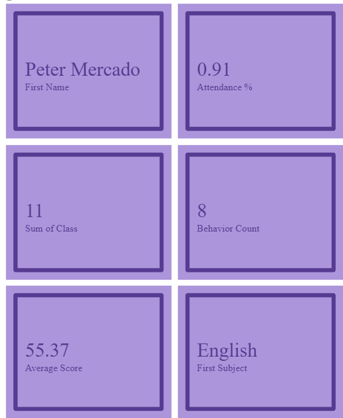

Shows Total Students, Average Score, and Attendance Percentage.

---

## 5. Average Score by Subject

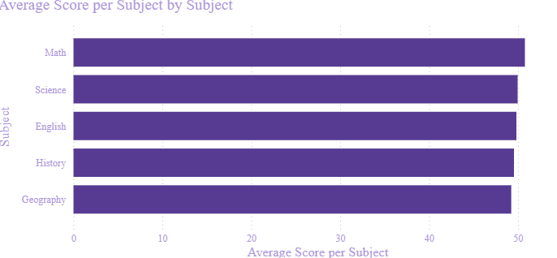

Displays subject-wise average scores using a bar chart.

---

## 6. Performance Trend by Term

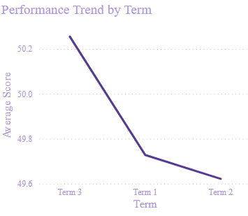

Shows academic performance trends across different terms.

---

## 7. Behavior Distribution Analysis

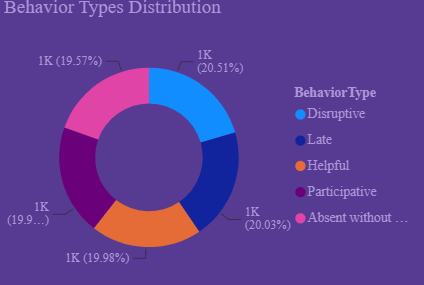

Visualizes student behavior categories using a donut chart.

---

## 8. Student Performance Table

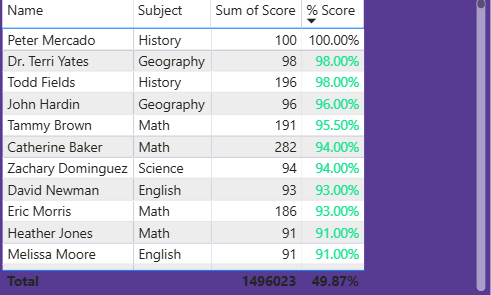

Displays student scores and percentage performance with conditional formatting.

---

## 9. Interactive Slicers

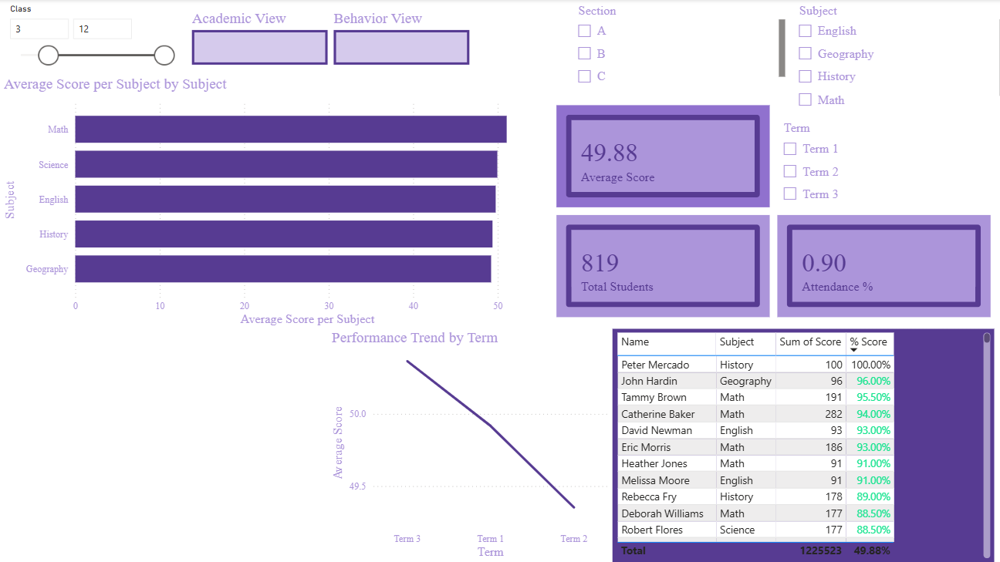

Provides dynamic filtering by Class, Section, Subject, and Term.

---

## 10. Drillthrough Student Profile

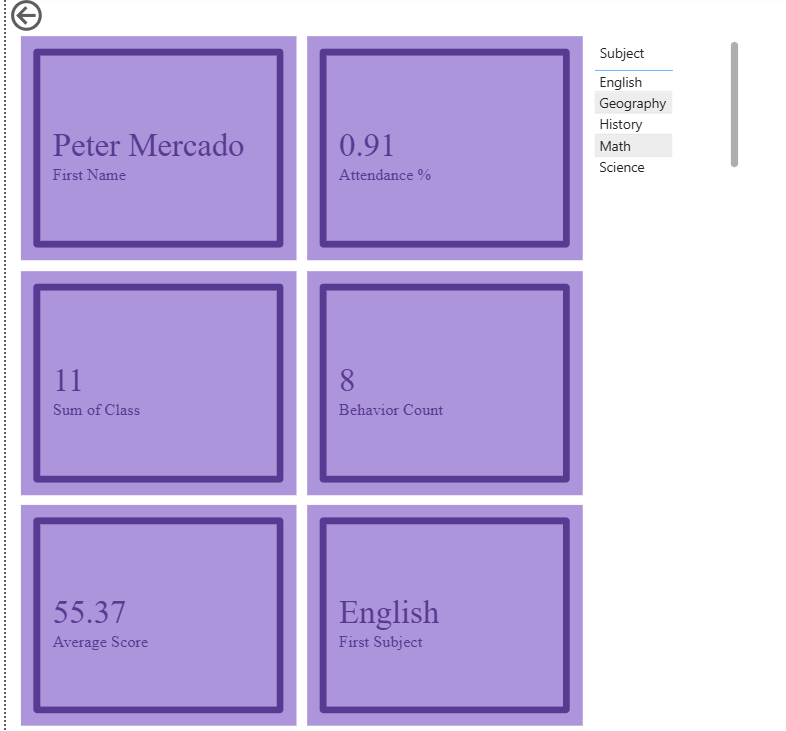

Allows detailed analysis of individual student performance and attendance.

---

## 11. Tooltip Page

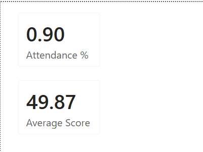

Displays additional information when hovering over visuals.

---

## 12. Bookmark Navigation

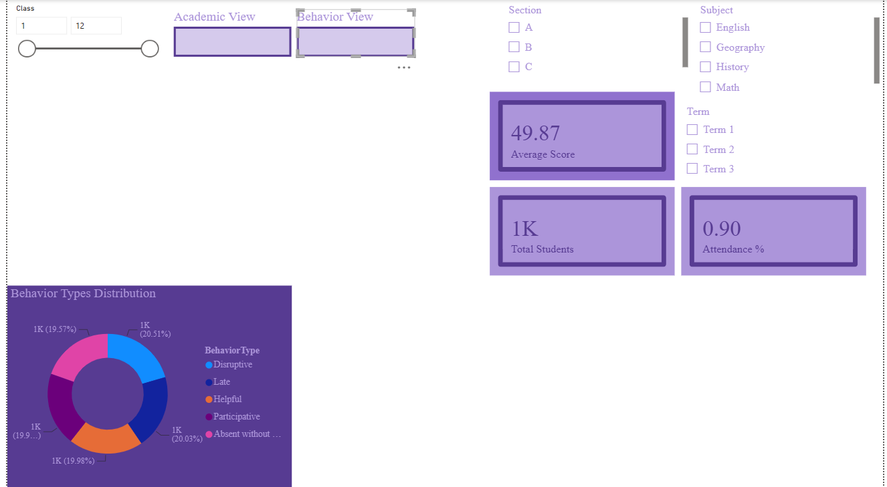

Provides navigation between Academic View and Behavior View.

---

## 13. Mobile Layout

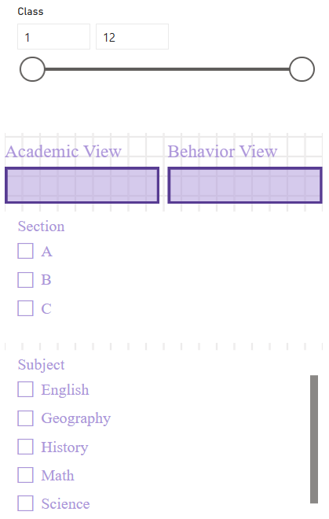


Shows the dashboard optimized for mobile devices.

---

# 📌 Key Insights

* Performance trends can be analyzed across multiple terms.
* Attendance percentage helps identify student engagement.
* Behavior analysis provides insights into student conduct.
* Subject-wise comparisons support academic evaluation.
* Interactive filters enable dynamic report exploration.

---

# ✅ Features Implemented

* Data Cleaning using Power Query
* Data Modeling
* DAX Measures
* KPI Cards
* Bar Chart
* Line Chart
* Donut Chart
* Conditional Formatting
* Slicers
* Drillthrough Page
* Tooltip Page
* Bookmark Navigation
* Mobile Layout

---

# 👨‍💻 Author

**Nilay Ahir**

TY BCA Student

Power BI & Data Analytics Enthusiast
